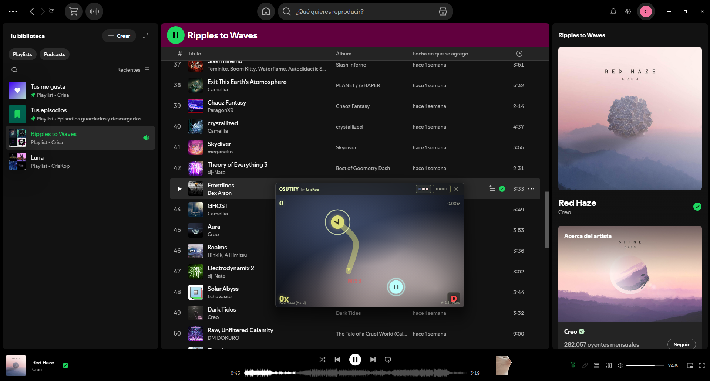

# Osutify

> Rhythm-based osu!-style mini-game synced to your Spotify playback.

Click and hold targets to the beat of the song you're listening to — without leaving Spotify. Targets are auto-generated from real beat timestamps in Spotify's Audio Analysis, and the whole window adapts its theme to the current album art.



---

## Features

- **Live beat sync** — targets spawn on real beats from Spotify's Audio Analysis API
- **3 target types** — single tap (lime), static hold (cyan), drag hold (yellow-lime) — each visually distinct
- **4 difficulties** — Easy / Normal / Hard / Expert, switchable on the fly
  - `Easy` uses bars (sparse)
  - `Normal` uses beats (default, balanced)
  - `Hard` adds loudness peaks
  - `Expert` uses tatums + peaks (max density)
- **Half-tempo auto-fix** — detects when Spotify reports half the real BPM (common in fast electronic/DnB tracks like Camellia) and switches to tatum-based mapping
- **Adaptive theming** — background morphs to the album's vibrant colors, mesh-gradient animated
- **Brand mode toggle** — switch to the original CrisKop dark/lime aesthetic
- **Picture-in-Picture** — always-on-top floating window, resizable, persists size across sessions
- **Scoring** — Perfect/Good/OK/Miss judgements, combo multiplier up to 3.0x, S–D letter grades, live accuracy

---

## Install

### Via Spicetify Marketplace (recommended)

1. Install [Spicetify Marketplace](https://github.com/spicetify/marketplace)
2. Open Spotify → Marketplace tab → Extensions
3. Search **Osutify**
4. Click Install

### Manual

1. Download `osutify.js` from this repo's `dist/` folder
2. Place it in your Spicetify Extensions folder:
   - **Windows**: `%APPDATA%\spicetify\Extensions\`
   - **macOS / Linux**: `~/.config/spicetify/Extensions/`
3. Run:
   ```
   spicetify config extensions osutify.js
   spicetify apply
   ```

---

## Usage

1. Click the gamepad-style icon in Spotify's player bar (bottom-right area) — it's the icon with 3 rays above a circle
2. A Picture-in-Picture window opens
3. Play any song — targets sync automatically
4. Header controls:
   - **3 color dots** — toggle adaptive (album colors) vs brand (CrisKop) theme
   - **Difficulty button** — cycle Easy → Normal → Hard → Expert
   - **✕** — close

### Input

- **Mouse**: click targets, hold for static holds, drag along the path for drag holds
- **Keyboard**: `Z` / `X` keys also count as taps (osu! style)

### Scoring

- **Perfect** (≤70ms): +300 × combo multiplier
- **Good** (≤160ms): +200 × multiplier
- **OK** (≤260ms): +100 × multiplier
- **Miss** (>260ms or wrong area): 0, combo resets
- Combo multiplier: 1.0× → 3.0× max (caps at 200 combo)
- Accuracy is weighted: Perfect=1.0, Good=0.66, OK=0.33, Miss=0
- Grade thresholds: S ≥95%, A ≥85%, B ≥70%, C ≥55%, D below

---

## Development

```bash
npm install
npm run watch     # dev mode with HMR
npm run build-local   # production build → dist/osutify.js
```

Stack: TypeScript 6, React 19, Zustand 5, Canvas 2D, spicetify-creator (esbuild).

---

## Credits

Made by **[CrisKop](https://criskop.com)**.

Inspired by [osu!](https://osu.ppy.sh) and Spicetify's vibrant ecosystem.

---

## License

[MIT](LICENSE) © CrisKop
